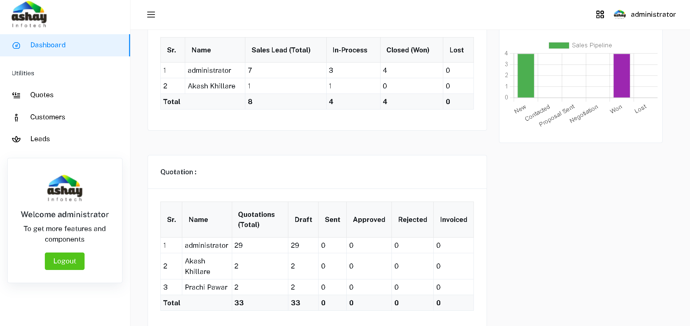
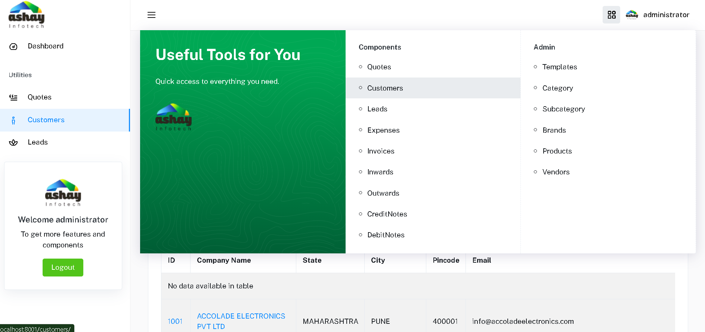
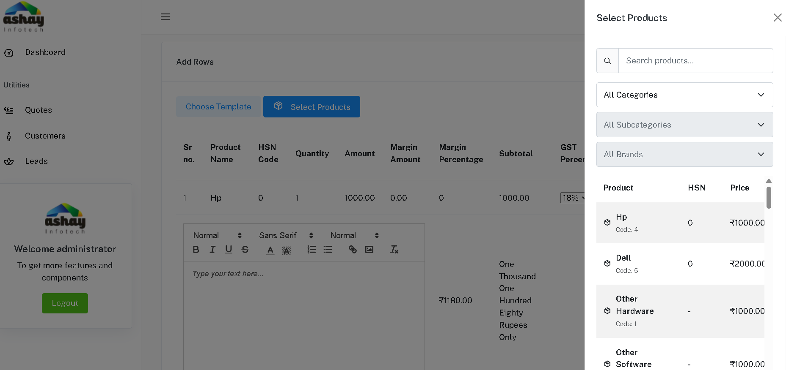

# INTERNAL ERP SYSTEM (DEMO STRUCTURE)

⚠️ **THIS IS A CODE-ONLY DEMO VERSION**

This repository contains a **sanitized, safe version** of the internal ERP system I developed for a client (Ashay Infotech). It is intended for portfolio and architectural reference only.

🔒 To protect client confidentiality:
- NO TEMPLATES, VIEWS, OR BUSINESS LOGIC are included  
- ONLY PROJECT STRUCTURE, MODELS, AND SETTINGS are shown  
- THIS CODE IS NOT MEANT TO RUN DIRECTLY — it's a backend architecture demo

🔗 **BLOG WRITE-UP**  
[Building a Scalable Internal ERP System with Django + IIS](https://v0-dhruv-lakhe-portfolio.vercel.app/blog/building-a-scalable-internal-erp-system-with-djang)

---

## 📁 PROJECT STRUCTURE

```
erp-platform-demo/
├── myerp/            # Django project settings
├── project/          # App with models (no views/templates included)
│   ├── models.py     # Client & Quotation model structure (safe to share)
├── manage.py
├── requirements.txt
└── README.md
```

---

## ⚙️ TECH STACK

- BACKEND: Django (Python)  
- DATABASE: PostgreSQL  
- DEPLOYMENT: Windows Server + IIS + FastCGI  
- VERSION CONTROL: Git  
- BACKUP: OneDrive via Python script

---

## 🚀 SETUP INSTRUCTIONS

> THIS VERSION IS FOR REFERENCE ONLY — it is not a deployable project.

If you want to explore how I structured the models, settings, and architecture:

```bash
git clone https://github.com/dhruv-lakhe/erp.git
cd erp
# explore project structure and models.py
```

---

## 🧾 MODEL OVERVIEW

```python
class Client(models.Model):
    name = models.CharField(max_length=255)
    email = models.EmailField()

class Quotation(models.Model):
    client = models.ForeignKey(Client, on_delete=models.CASCADE)
    created_at = models.DateTimeField(auto_now_add=True)
    total_amount = models.DecimalField(max_digits=10, decimal_places=2)
```

---

## 📌 ABOUT THIS DEMO

This repo showcases:
- How I structure Django ERP systems
- Clean separation of concerns
- Scalable model-first design

## 📸 ERP SYSTEM UI PREVIEWS

## 📸 ERP SYSTEM UI PREVIEWS

Below are a few safe screenshots from the internal ERP system (non-sensitive views):








If you're building something similar and want to connect:

📬 EMAIL: [lakhedhruv@outlook.com](mailto:lakhedhruv@outlook.com)  
🤝 LINKEDIN: [linkedin.com/in/dhruv-lakhe](https://linkedin.com/in/dhruv-lakhe)

---

> 💡 MORE BLOGS AT: [v0-dhruv-lakhe-portfolio.vercel.app/blog](https://v0-dhruv-lakhe-portfolio.vercel.app/blog)


## 🤖 COMING SOON: AI REPORTING AGENT

The next version of this ERP system will include an AI-powered agent built using **LangChain** and **SQL agents**. Users will be able to chat directly with the database using natural language and instantly generate custom reports like:

- “Show quotations created last week”
- “Lead conversion rate by month”
- “Top clients by margin this quarter”

This feature will eliminate manual reporting and bring **natural language querying** to internal operations.

🔗 Blog and demo coming soon: [View AI Agent Update](#)